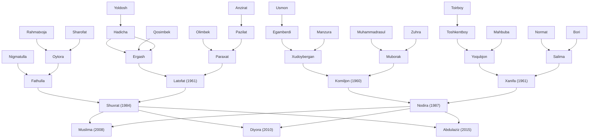

# Oila shajarasi

```mermaid
flowchart TD
  %% 6-avlod
  Y1["Toirboy"] --> X1["Toshkentboy"]
  Y2["Usmon"] --> X2["Egamberdi"]
  Y3["Yoldosh"] --> X3["Hadicha"]
  Y4["Anzirat"] --> X4["Pazilat"]

  %% 5-avlod
  X1 --> W1["Yoqubjon"]
  M1["Mahbuba"] --> W1
  X2 --> W2["Xudoybergan"]
  M2["Manzura"] --> W2
  X3 --> W3["Ergash"]
  M3["Qosimbek"] --> W3
  X3 --> W3
  O1["Rahmatxoja"] --> V1["Oytora"]
  O2["Sharofat"] --> V1
  Q1["Muhammadrasul"] --> V2["Muborak"]
  Q2["Zuhra"] --> V2
  N1["Normat"] --> V3["Salima"]
  N2["Bori"] --> V3
  P1["Olimbek"] --> V4["Paraxat"]
  X4 --> V4

  %% 4-avlod
  U1["Nigmatulla"] --> T1["Fathulla"]
  V1 --> T1
  W3 --> T2["Latofat (1961)"]
  V4 --> T2
  W2 --> T3["Komiljon (1960)"]
  V2 --> T3
  W1 --> T4["Xanifa (1961)"]
  V3 --> T4

  %% 3-avlod
  T1 --> S1["Shuxrat (1984)"]
  T2 --> S1
  T3 --> S2["Nodira (1987)"]
  T4 --> S2

  %% 1-avlod
  S1 --> A["Muslima (2008)"]
  S2 --> A
  S1 --> B["Diyora (2010)"]
  S2 --> B
  S1 --> C["Abdulaziz (2015)"]
  S2 --> C
```
